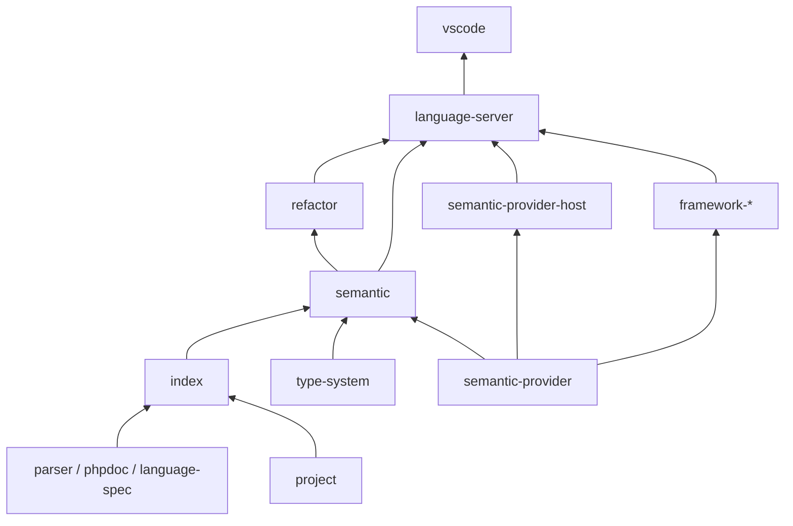

# 组件架构

## 技术与所有权

TypeScript + Node.js 独立语言服务器进程；Tree-sitter/WASM 作为语法基础，自研语义 AST、名称绑定、类型系统和分析引擎。复用 LSP 协议库与通用存储设施。性能优化以基准结果为依据，不预先重写为其他语言。

独立服务器优先使用 stdio；VS Code adapter 不承载全项目分析。Web Extension 不列为首版要求。发布时明确 Node/VS Code 最低版本并验证 WASM 资源打包。

## 渐进组件化

首发先落地 parser、phpdoc、project、index、type-system、semantic、language-spec、refactor、language-server、testkit 与 vscode 的必要边界；refactor 已由接口方法生成实际消费，不是空包。其余框架与互操作包在真实需求出现时提取。框架插件、互操作和高级重构不阻塞 R1。扩展组合由 integrations.md 规定所有权。

## Workspace 包

遵循 [Monorepo 与独立组件发布规则](packaging.md)。完整组件必须具备可消费的公开 API 和独立 tarball 验收；内部 workspace 阶段不豁免依赖边界。

以下包统一采用 `@php-companion/` 前缀，目录位于 `packages/`。`vscode` 是实现包名，公开扩展 ID 保持 `sohophp.php-companion`。

| 包 | 职责 | 禁止承担 |
| --- | --- | --- |
| language-spec | PHP 版本规则、内建符号快照、来源与许可 | 执行项目 PHP |
| parser | CST、语义 AST、错误恢复、增量解析、范围映射 | 类型推断、编辑器 API |
| phpdoc | 类型表达式、模板和注解 AST | 正则猜测完整类型语义 |
| project | Composer、文件集合、目标版本、多根与依赖 | 加载 autoloader |
| index | 声明/引用事实、依赖关系、缓存及失效 | UI、独立重复的类型规则 |
| type-system | 类型代数、兼容性、替换、合并与收窄运算 | 文件 IO、LSP、框架硬编码 |
| semantic-provider | 版本化外部语义事实、来源位置、完整快照与运行时校验 | 解析 PHP、加载框架或执行语义查询 |
| semantic-provider-host | 显式配置 Provider 的一次性子进程、JSON 协议、超时与输出限制 | 自动执行项目元数据、提供安全沙箱或产生语义事实 |
| semantic | 绑定、成员解析、表达式推断、控制流与诊断事实 | VS Code Provider |
| refactor | 前置条件、冲突检测、带版本编辑计划 | 直接写磁盘 |
| language-server | LSP 适配、会话、调度、取消、结果版本校验 | 第二套语义实现 |
| framework-symfony | 服务、路由、Controller 上下文扩展 | 重复 Twig 模板索引 |
| framework-doctrine | Entity/Repository/关联与查询类型扩展 | 启动 ORM 或连接数据库 |
| interop | Twig 交换协议、序列化类型、能力协商 | 导入双方内部模型 |
| vscode | 服务器启动、UI、命令、配置与事务应用 | 解析 PHP 或计算类型 |
| testkit | 标记样例、协议客户端、对照与性能框架 | 产品运行时依赖 |

## 单向依赖

箭头表示下层能力被上层使用。索引通过查询接口提供声明事实，语义分析产生的派生依赖通过明确写入接口保存；index 不反向导入 semantic。框架组件实现独立 `semantic-provider` 契约，由服务器组装并按 provider 身份原子替换；semantic 不导入具体框架包。

## 核心数据契约

- `DocumentSnapshot`：URI、文档版本、文本哈希、行映射；未保存内容优先于磁盘。
- `SymbolId`：项目、作用域、声明种类及身份；不同命名空间和大小写规则分别处理，不统一小写所有 PHP 符号。
- `Declaration`：成员/函数签名、可见性、静态性、泛型、继承、源码范围与版本来源。
- `Type`：标量、字面量、对象、泛型、Union/Intersection、数组形状、Callable、never；显式 mixed、未知和错误恢复分开表示。
- `AnalysisResult`：文档/项目快照、结果、依赖、完整性和分析预算状态。
- `SemanticFactsContribution`：schema、provider 身份、generation、完整性及带来源的方法/属性/字面量返回事实；同一 provider 每次提交完整快照。
- `SemanticProviderRequest/Response`：一次请求对应一次 JSON 响应；服务器只执行用户显式配置的可信命令，并校验协议版本、请求 ID、provider 身份、generation 与完整性后提交。
- `EditPlan`：带版本文本编辑、文件操作、依赖顺序、冲突、无法确认的引用、预览说明。

P0 固定契约和序列化版本；磁盘缓存不得直接序列化 Tree-sitter 对象或隐含引用关系。缓存失配可重建，不能返回错误结果。

## 分析生命周期

1. 激活仅注册客户端；打开 PHP 文档后初始化服务器和当前文件分析。
2. 优先提供当前文件结果，后台建立项目与 vendor 声明索引。
3. 使用增量 CST 更新和按符号依赖失效；函数体编辑不默认重建全项目。
4. 签名、继承、配置、PHP 版本或 Composer 依赖变化时扩大失效范围。
5. 长任务分批处理、可取消，查询与索引竞争时优先交互请求。
6. 结果返回前检查文档版本；取消/过期结果不能重新发布诊断或应用编辑。
7. 设置文件数、单文件、缓存内存、递归和类型展开预算；达到限制时报告不完整状态。

项目文件、vendor 声明、内建 stubs 和打开文件分别管理。vendor 默认只读，但参与类型与导航；不沿用旧索引完全排除 vendor 的模型。多工作区不能串用同名符号或 PHP 版本。

## 迁移策略

- 先提取现有模块并保留兼容门面，不同时改写所有命令。
- 独立安装与组合包默认使用自研服务器；升级环境若已有 Intelephense 且尚无显式选择，则保留旧 Provider。显式配置始终覆盖自动迁移判断。
- 每个迁移完成的功能删除旧语义实现；同一模式下只有一个 Rename、补全或诊断所有者。
- 旧 `indexing.mode` 映射到工作流索引语义；独立模式的索引配置单独设计，迁移不能静默改变用户选择。
- 新独立模式遇到其他 PHP LS 时提示冲突与处理方法，不自动禁用扩展或重写用户设置。
- 本地化、命令 ID、公开扩展 ID 和现有工作流回归一起维护。

## 证据与限制

内建数据优先来自可审计的公开 PHP 资料/stubs，记录许可与生成过程。受控测试可运行可信 PHP fixtures；产品静态分析不得执行项目 PHP、Composer scripts 或 autoloader。框架适配器可以读取项目已生成的文本元数据或调试容器 XML，但必须拒绝外部实体、忽略秘密/参数值，并在来源过期或结构不完整时整组降级。未知动态调用保守降级，并将不确定性传递至重构与诊断。
